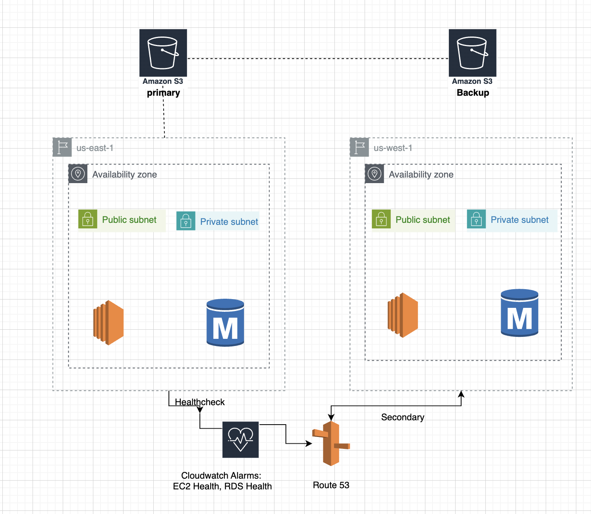

# 🌐 AWS Disaster Management Project

This project demonstrates a **highly available**, **fault-tolerant** static web application hosted on **AWS**, using **Terraform** to provision all infrastructure as code.

---

## 🎯 Objective

To build a resilient infrastructure that ensures:

- 🔁 Automated failover routing between EC2 instances  
- 🩺 Health checks for monitoring instance status  
- 🖥️ Hosting a static website using EC2 and S3  
- 🌐 DNS management with Route 53  
- 🛢️ Amazon RDS as a secure MySQL backend database  

---

## 🛠️ Technologies Used

- Terraform  
- AWS EC2 (Primary & Secondary Instances)  
- Amazon Route 53  
- Amazon S3 (for static backup)  
- Amazon RDS (MySQL)  
- Git & GitHub  

---

## 🧱 Architecture



---

## 📁 Directory Structure

Disaster-Management/
├── .gitignore
├── architecture.png
├── ec2.tf
├── outputs.tf
├── rds.tf
├── replication.tf
├── route53.tf
├── s3.tf
├── vpc.tf
├── html/
│ ├── index.html
│ ├── Styles.css
│ ├── Logo.png
│ └── other-assets
└── README.md

yaml
Copy
Edit

---

## ☁️ Features

✅ EC2 with Apache hosting static website  
✅ S3 backup for static content (failover access)  
✅ Route 53 DNS failover using health checks  
✅ RDS MySQL for backend database storage  
✅ Fully automated with Terraform  

---

## 🌐 Domain

Website hosted at:  
🔗 [https://dineshprojectsmine.shop](https://dineshprojectsmine.shop)

---

## 🚀 Deployment Guide

### 1️⃣ Initialize Terraform

```bash
terraform init
2️⃣ Validate & Plan
bash
Copy
Edit
terraform validate
terraform plan
3️⃣ Apply Infrastructure
bash
Copy
Edit
terraform apply
4️⃣ Update DNS via Route 53
Terraform manages failover routing by pointing:

✅ Primary EC2 → A Record + Health Check

✅ Secondary EC2 → A Record (Failover)

🔒 .gitignore Includes
bash
Copy
Edit
# Terraform
.terraform/
*.tfstate
*.tfstate.backup

# AWS Credentials
*.pem

# System Files
.DS_Store
__MACOSX/

# IDE Config
.vscode/
.idea/
📚 Future Scope
🔄 Add CI/CD pipelines using GitHub Actions

🌍 Use CloudFront CDN with S3

🔐 Enable RDS snapshots, encryption & backups

📊 Integrate CloudWatch for monitoring & alarms

👨‍💻 Author
Dinesh Kumar Kasi
GitHub: @dineshkumarkasi
